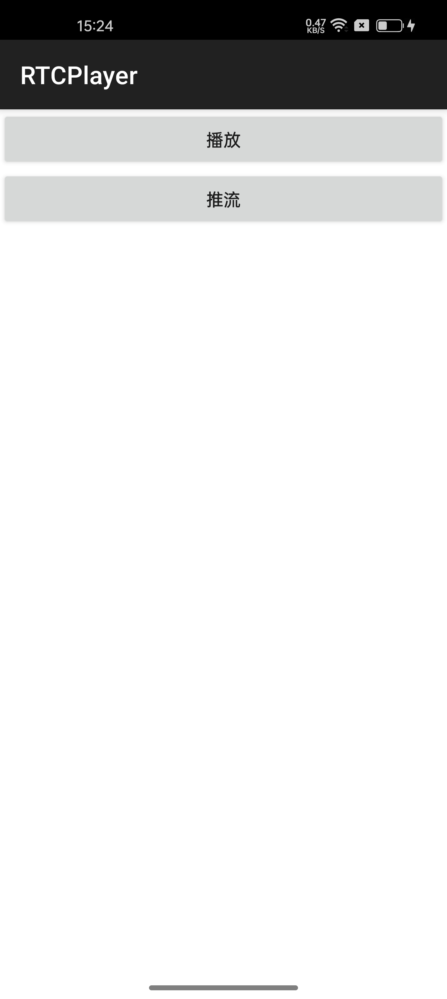
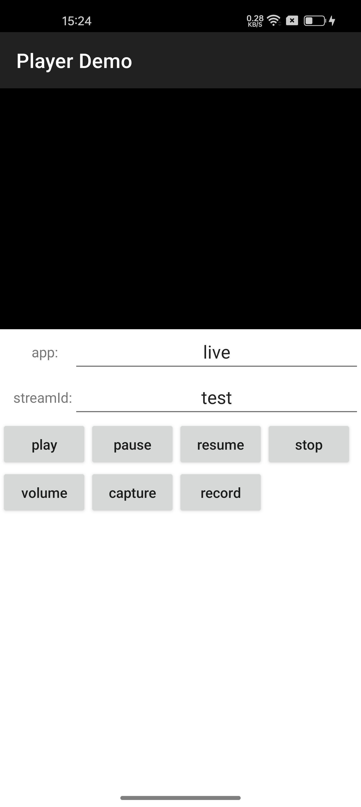
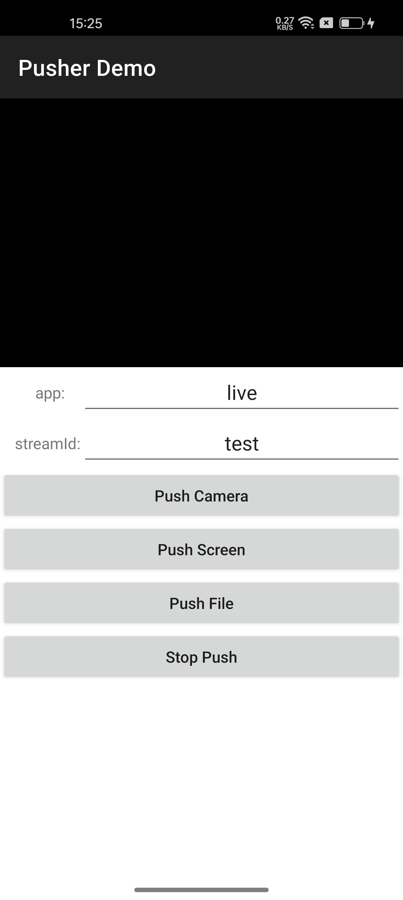
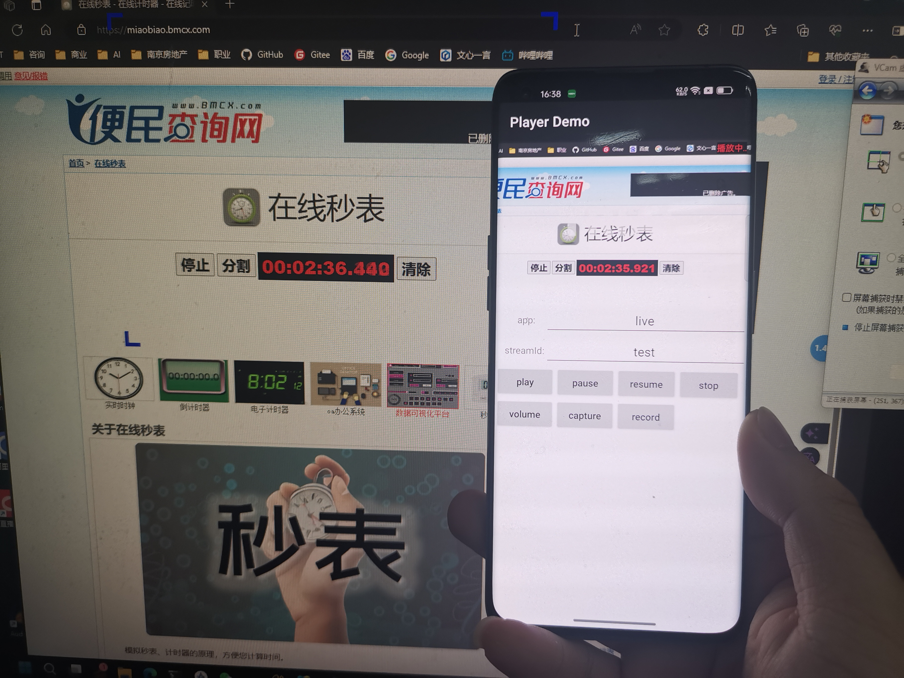
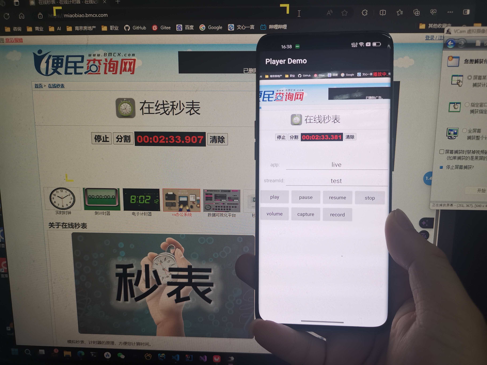
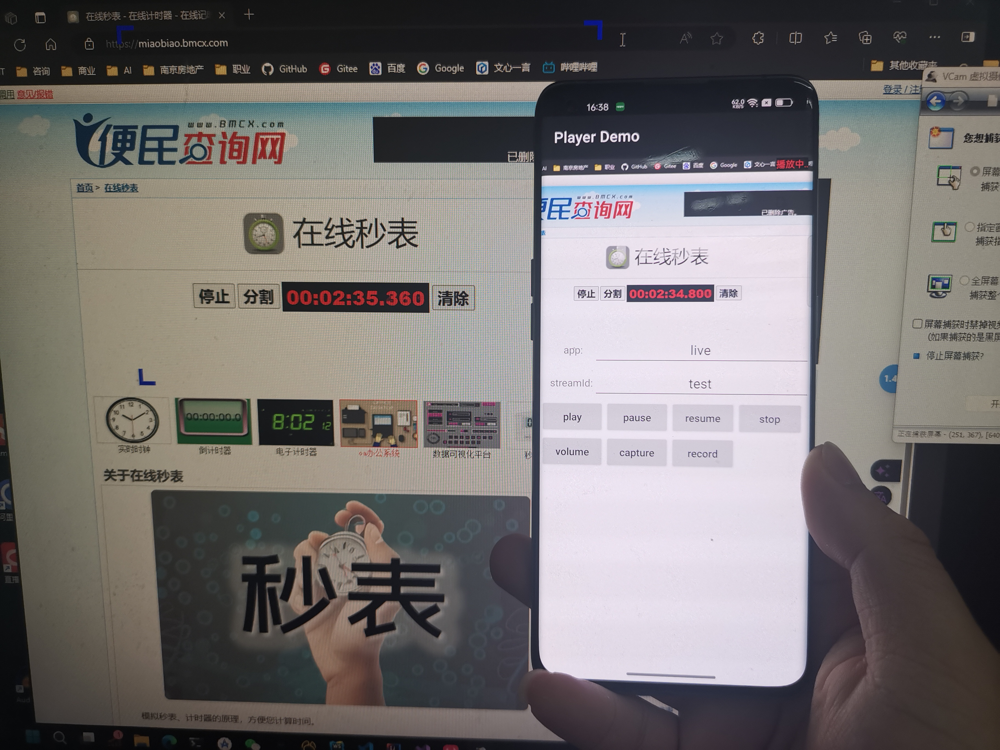

# RTCPlayer 播放器

一个基于Android客户端的的RTC播放器

## 项目特点

- 低延迟
- [X]支持[ZLMediakit](https://github.com/ZLMediaKit/ZLMediaKit)流媒体
- [ ]支持[SRS](https://github.com/ossrs/srs)
- [ ]支持[Janus](https://github.com/meetecho/janus-gateway)

    &nbsp;&nbsp;&nbsp;
    &nbsp;&nbsp;&nbsp;
    

## 延迟情况

- **网页端推流，Android端播放**

    &nbsp;&nbsp;&nbsp;
    &nbsp;&nbsp;&nbsp;
    

三次延迟分别为：490ms、526ms、560ms

- **Android端推屏幕流，网页端播放**

    &nbsp;&nbsp;&nbsp;
    &nbsp;&nbsp;&nbsp;
    

三次延迟分别为：440ms、430ms、387ms

## 接口说明

### Player

### Pusher